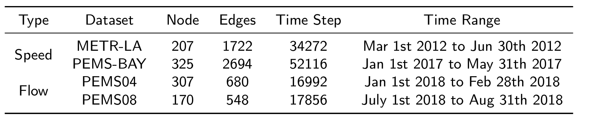

# Spatial-Temporal Forecasting Library

This is an open-source library for deep learning researchers, especially for spatial-temporal forecasting.

We provide a neat code base to evaluate advanced spatial-temporal models or develop your model.


# 📚Model Statics 

| Model    | Journals/Conferences                                    | Year |
| :------- | ------------------------------------------------------- | ---- |
| STGCN    | IJCAI                                                   | 2018 |
| DCRNN    | ICLR                                                    | 2018 |
| ASTGCN   | AAAI                                                    | 2019 |
| T-GCN    | IEEE Transactions on Intelligent Transportation Systems | 2019 |
| GWNET    | IJCAI                                                   | 2019 |
| MSTGCN   | AAAI                                                    | 2019 |
| AGCRN    | NIPS                                                    | 2020 |
| GMAN     | AAAI                                                    | 2020 |
| DFKN     | SIGSPATIAL                                              | 2020 |
| STTNS    | Arxiv                                                   | 2020 |
| HGCN     | AAAI                                                    | 2021 |
| SANN     | Neural Computing and Applications                       | 2021 |
| ST-Norm  | CIKM                                                    | 2021 |
| STGODE   | SIGKDD                                                  | 2021 |
| DGCN     | IEEE Transactions on Intelligent Transportation Systems | 2022 |
| D2STGNN  | VLDB                                                    | 2022 |
| STID     | CIKM                                                    | 2022 |
| PDFormer | AAAI                                                    | 2023 |
| AFDGCN   | ECAI                                                    | 2023 |
| STWave   | ICDE                                                    | 2023 |
| MegaCRN  | AAAI                                                    | 2023 |
| PGCN     | IEEE Transactions on Intelligent Transportation Systems | 2024 |
| PMC-GCN  | IEEE Transactions on Intelligent Transportation Systems | 2024 |
| STIDGCN  | IEEE Transactions on Intelligent Transportation Systems | 2024 |
| TESTAM   | ICLR                                                    | 2024 |
| WAVGCRN  | Arxiv                                                   | 2024 |

# 🧾Dataset Statics




# Get Started

<span id='all_catelogue'/>

### Table of Contents:

- <a href='#Install dependecies'>1. Install dependecies</a>
- <a href='#Data Preparation'>2. Data Preparation </a>
- <a href='#Run Experiment'>3. Run Experiment</a>

<span id='Install dependecies'/>

## 📝Install dependecies  <a href='#all_catelogue'>[Back to Top]</a>

Install the required packages

```bash
pip install -r requirements.txt
```

<span id='Data Preparation'/>

# 👉Data Preparation<a href='#all_catelogue'>[Back to Top]</a>

The Los Angeles traffic speed files (METR-LA) and the Bay Area traffic speed files (PEMS-BAY), as well as the Los Angeles traffic flow files (PEMS04 and PEMS08), can be accessed and downloaded from [Google Drive](https://drive.google.com/drive/folders/1lcv-QYH7nAk9ciGFOurSam6SJVWaW-lg?usp=sharing). Please place these files in the `datasets/` folder. The tree structure of the files is as follows:

```
\datasets
├─METR-LA
│
├─PEMS04
│
├─PEMS08
│
├─PeMS-Bay
│
└─cache
```

<span id='Run Experiment'/>

# 🚀Run Experiment<a href='#all_catelogue'>[Back to Top]</a>

We have provided all the experimental scripts for the benchmarks in the `./scripts` folder, which covers all the benchmarking experiments. To reproduce the results, you can run the following shell code.

```bash
 ./scripts/METR-LA.sh
 ./scripts/PEMS04.sh
 ./scripts/PEMS08.sh
 ./scripts/PeMS-Bay.sh
```


## 📧Contact

For any questions or feedback, feel free to contact [Liwei Deng](mailto:liweidengdavid@gmail.com) or [Junhao Tan](mailto:827092078@qq.com).


# 🌟Star

If you find this code useful in your research or applications, please consider giving our repositories a **star**.


# 🤝Contributors

We express our gratitude to the following members for their contributions to the project, completed under the guidance of Professor [Hao Wang](https://tccofwang.github.io/index.html):

 [Liwei Deng](https://liweidengdavid.github.io/), [Junhao Tan](http://paradise2200.github.io)

